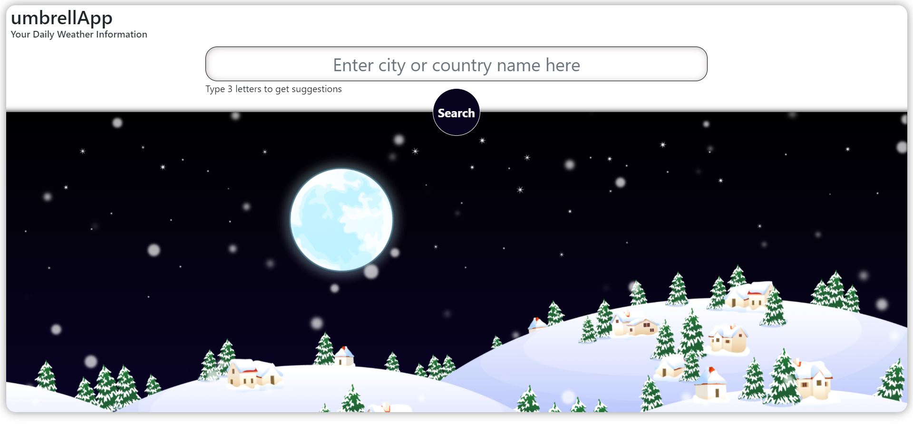
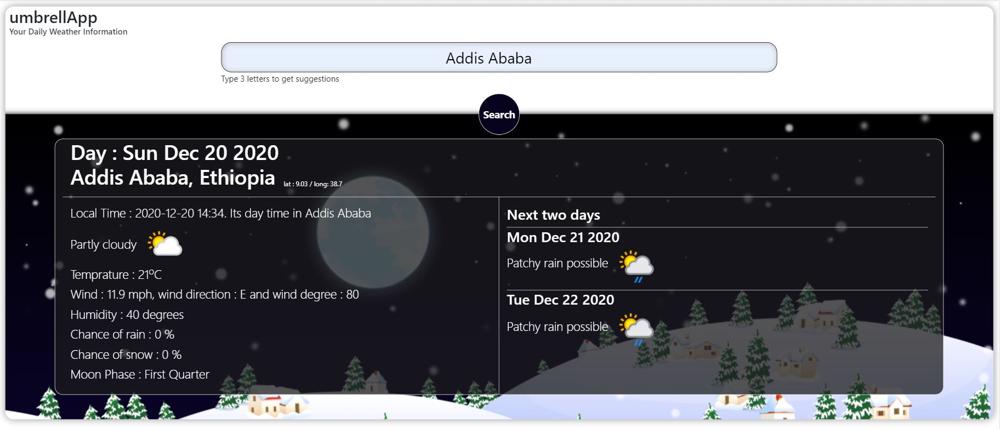
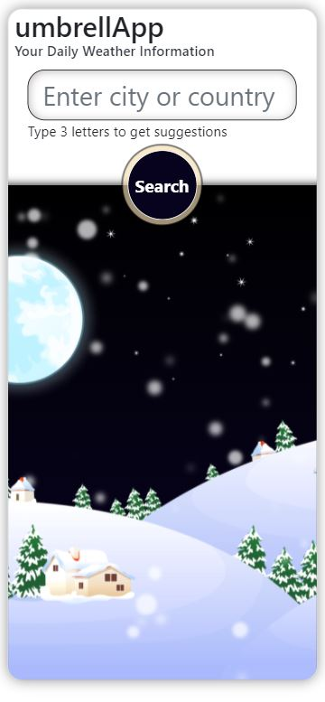

# Appmosphere, Weather app with weather API

> This is a javascript project made to create a Weather app by fetching live weather updates and results from a provider through their API. This project also fetches suggestions for city or country. The page is dynamically rendered it using JavaScript DOM manipulation. Only JavaScript is used to generate the entire contents of the website. 

## Features

- Weather information of any valid city
- Suggestions of city or country names as you type
- Snow effect background with SCSS

## Built With

- JavaScript
- Fetch Api
- ES6 Modules
- HTML
- CSS
- Bootstrap
- Webpack
- npm
- Eslint
- StyleLint

## Live Demo

[Click to see Appmosphere, Weather app live]()

# ScreenShots
### Home Page

### Search Page

### Mobile view

### Prerequisites
- Web browser
- CLI tool

## Getting Started
- Clone this repo on your local machine
- Go to the cloned folder
- If you want to repack the file
  - Run `npm install` on the terminal to install dependancies
  - Run `npm run build` to pack the files in the src folder
  - Go to the dist folder and open index.html
  - Run `npm run start` to open it on a live server
- Else
  - Just Go to the dist folder and open index.html

## Author

👤 **Bereket Beshane**

- Github: [@Berabjesus](https://github.com/Berabjesus)
- Twitter: [@bereket_ababu_b](https://twitter.com/bereket_ababu_b)
- Linkedin: Linkedin: [linkedin](https://www.linkedin.com/in/bereket-beshane-a1b75a1a9/) 

## 🤝 Contributing

Contributions, issues and feature requests are welcome!

Feel free to check the [issues page](https://github.com/Berabjesus/Weather-App-with-weatherAPI.com/issues).

## Show your support

Give a ⭐️ if you like this project!

## Acknowledgments
- Microverse
- TheOdinProject

## 📝 License

This project is [MIT](lic.url) licensed.
